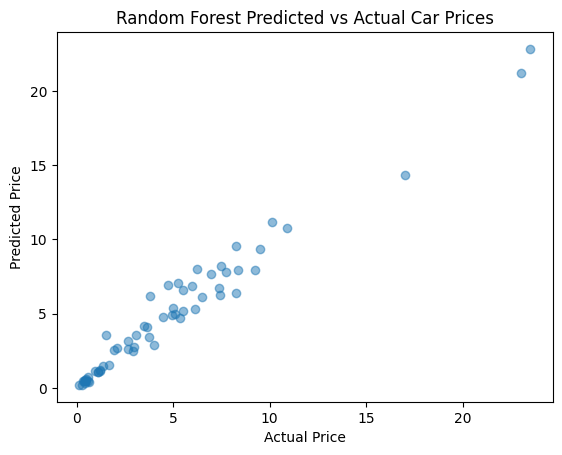

# Car Price Prediction 🚗💰

This project is part of my **Data Science Internship** at **CodeAlpha**. The goal was to build a machine learning model that can predict the selling price of used cars based on various features such as the car's age, mileage, fuel type, and transmission.

## 📌 Project Overview
* **Student ID:** CA/DF1/22584
* **Internship Domain:** Data Science
* **Project Name:** Car Price Prediction
* **Organization:** CodeAlpha

## 📂 Dataset
The dataset used for this project contains information about used cars, including:
* **Car Name:** The brand and model of the car.
* **Year:** The year the car was purchased.
* **Selling Price:** The target variable we are predicting.
* **Present Price:** The current showroom price of the car.
* **Kms Driven:** The total distance driven by the car.
* **Fuel Type:** Petrol, Diesel, or CNG.
* **Seller Type:** Dealer or Individual.
* **Transmission:** Manual or Automatic.
* **Owner:** The number of previous owners.

## 🛠️ Technologies Used
* **Python** (Programming Language)
* **Pandas** (Data Manipulation)
* **Matplotlib & Seaborn** (Data Visualization)
* **Scikit-Learn** (Machine Learning Library)
* **Linear Regression** (Predictive Model)
* **Google Colab / Jupyter Notebook** (IDE)

## 🚀 Key Features
1.  **Data Preprocessing:** Handled categorical variables (Fuel Type, Transmission, etc.) using One-Hot Encoding.
2.  **Exploratory Data Analysis (EDA):** Analyzed the relationship between features and car prices.
3.  **Model Training:** Trained a **Linear Regression** model to predict car prices.
4.  **Model Evaluation:** Achieved an **R-Squared Score of ~0.85 (85%)** on the test set.
5.  **Visualization:** Plotted a scatter plot to compare Actual vs. Predicted prices.

## 📊 Results
* **R-Squared Score:** 0.85
* **Visuals:** The model shows a strong positive correlation between predicted and actual prices.

## 📷 Output
*()*

## 🤝 Acknowledgement
Thanks to **@CodeAlpha** for providing this opportunity to work on real-world regression problems.

---
**Author:** Sunit Modak
**LinkedIn:** [https://www.linkedin.com/in/sunit-modak-6064403a5/]
